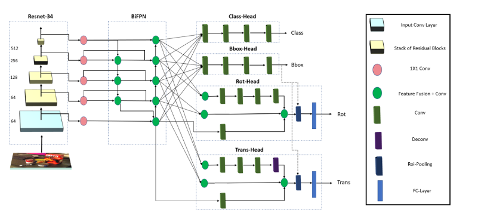

# Regpose: A PyTorch Implementation of the Regpose Framework for 6DoF Object Pose Estimation

### Introduction

In this project The 6DoF Pose estimation Network Regpose was implemented: 
Regpose is an end-to-end 6DoF pose estimation network. Regpose estimated the class of objects appearing in an images frame and theire class. Followed by regressing the global translation and rotation. The network has two different approaches implemented, how it regresses the rotation, one using a quaternion representation and one using a 6D rotation representation. The approach is motivated by Efficientdet [arXiv](https://arxiv.org/abs/1911.09070). The code was taken from [Project](https://github.com/zylo117/Yet-Another-EfficientDet-Pytorch).

<p align="center"></p>
### Required environment

- Ubuntu 20.04
- PyTorch 1.9.0
- CUDA 10.0 

### Installation

Use python3.8.11
1. Install python packages
   ```Shell
   pip install -r requirement.txt
   ```
### Dataset and Code Structure
1. Download the YCB-Video dataset from [here](https://rse-lab.cs.washington.edu/projects/posecnn/).
2. Move the folder containing synthetic images into the folder images. 
3. Download VOC2012 Dataset and render synthetic images with VOC2012 background using syn_generator.py 
4. Put the Dataset in the Following Structure 

```
Root
├── CoCo_AnnotationYCB.py
|── syn_generator.py
|── keyframe.json (Test-json annotation File generated using CoCo_AnnotationYCB.py)
|── train_synt.json (Train-json annotation File generated using CoCo_AnnotationYCB.py)
├── images 
│   ├─── 0000
│   │   └── 0001
    |   └── 0002
    |   └── ...
    |   └── data_syn
│   └── image_sets
│       ├── train.txt
│       │   ├── val.txt
│       │   └── keyframes.txt
|       |   └── ...
│       ├── models
│           ├── 002_master_chef_can
|           |   └── points.xyz
|           |   └── merged_cloud.ply
|           |   └── ...
│           └── 003_cracker_box
|           │   │
|           |   └── points.xyz
|           |   └── merged_cloud.ply
|           |   └── ...
│           └──  ....
|
|──Regpose 
   └──  tools
   └──  lib
   └──  Config-Files (includes Config Files for the two different heads)
   | 	└── 6D-Head 
   |    |	└── Config-All.yaml (Config File for Fine Tuning)
   |    |	└──  Config-Class.yaml (Config File to train, Backbone, BiFPN, Class and bbox regression head)
   |    |	└── Config-Pose.yaml (Config File to train translation and Rotation head)
   |    |	└── Config-Test.yaml (Config File for validation and testing)
   |	└── Quat-Head
   |     	└── Config-All.yaml (Config File for Fine Tuning)
   |     	└──  Config-Class.yaml (Config File to train, Backbone, BiFPN, Class and bbox regression head)
   |     	└── Config-Pose.yaml (Config File to train translation and Rotation head)
   |     	└── Config-Test.yaml (Config File for validation and testing)
   └──  exp (automatically built in running containing output models) 
   |
   └──Networks (Folder containing final weights to be downloaded)
    └──Regpose6D-Final.checkpoint
    └── Regquat-Final.checkpoint
```
5. run CoCo_AnnotationYCB.py to annotate YCB-Video Dataset.
6. download weights from (Networks Folder) from [Link] (https://drive.google.com/drive/folders/1k8fjShIf7mDYztB_KSyvQyC2Qy5kKm4Q?usp=sharing)
7. Download Annotation Files from [annotation] (https://drive.google.com/drive/folders/1u2WSlYTJs5lFrS7_wYwDmB6Lz5oSpG5I?usp=sharing) and put them in source Folder (see Data Structure)
### Training Strategy

1. go to config.py in lib folder and chose the config file Config-Class.yaml as configuration file to train  Backbone, BiFPN, Class and bbox regression head (For training run main.py). 
2. After training go to config.py in lib folder and chose the config file Config-Pose.yaml  to train translation and rotation head, while chosing specifieng the output weights from previous training as input. (For training run main.py)
3. For fine-tuning go to config.py in lib folder and chose the config file Config-All.yaml, while specifieng the model to load in the Config-All.yaml as the outputet weights from the previous training step. 

### Testing or Validation 

1. go to config.py in lib folder and chose the config file Config-All.yaml as configuration file to test, choose the used network (e.g: ../Networks/Regpose6D-Final.checkpoint) to test the 6D head architecture for example.
2. run the model using eval.py in tools folder.

